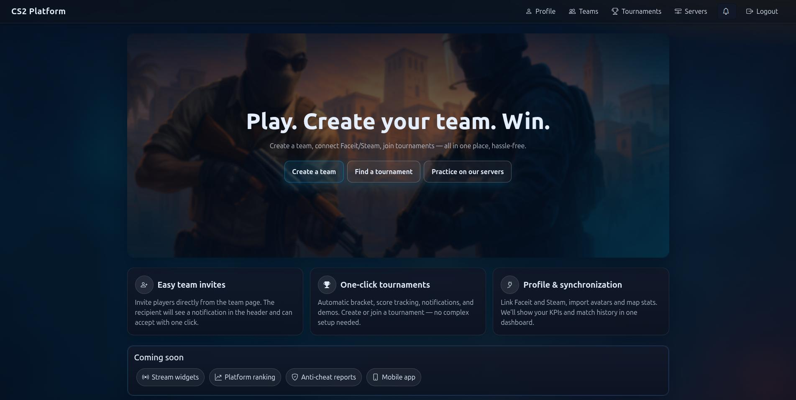

# 🎮 CS2 Platform

A production-ready Django-based platform for hosting and managing CS2 tournaments with real-time features.
Includes team management, registration workflow, bracket generation, match pages, map veto, and live updates powered by Django Channels & WebSockets.

### Main Page

### 🚀 Key Features

✔ Full tournament lifecycle: registration → bracket → matches → results → finish

✔ Single-elimination bracket generation & progression

✔ Atomic DB operations for reliable tournament updates

✔ Real-time UI updates via WebSockets (Channels + Redis)

✔ Live match pages: scores, bans, veto state, final map

✔ CS2-style map veto system (turn-based banning + captain-only access)

✔ Role-based access control for staff & tournament admins

✔ REST API for tournaments & matches (Django REST Framework)

✔ HTMX-powered UI for dynamic, SPA-like interactions

✔ Dockerized, ready for deployment and scaling

### 🧱 Tech Stack

Django 5, Django REST Framework

Django Channels + Redis (WebSockets)

PostgreSQL

Docker & docker compose

pytest (tests)

Whitenoise (static files)

### 🐳 Quick Start (Docker)
1️⃣ Create .env
cp .env.example .env

2️⃣ Build & start containers
docker compose build
docker compose up -d

3️⃣ Run migrations & create admin
docker compose exec web python manage.py migrate  
docker compose exec web python manage.py createsuperuser

4️⃣ Open the app

🌐 App: http://localhost:8000

🔐 Admin: http://localhost:8000/admin

If using django.contrib.sites, create a Site with domain localhost:8000.

Stop containers
docker compose down

### 🔧 Environment Variables
DJANGO_DEBUG=1  
DJANGO_SECRET_KEY=change-me  
DJANGO_ALLOWED_HOSTS=localhost,127.0.0.1
DJANGO_CSRF_TRUSTED_ORIGINS=http://localhost:8000

FACEIT_API_KEY=...  
STEAM_WEB_API_KEY=...

POSTGRES_DB=cs2db  
POSTGRES_USER=cs2user  
POSTGRES_PASSWORD=changeme  
POSTGRES_HOST=db  
POSTGRES_PORT=5432

### Channels / Redis
REDIS_URL=redis://redis:6379/0

💻 Local Development (without Docker)

Requires PostgreSQL + Redis installed.

python -m venv venv
source venv/bin/activate  
pip install -r requirements.txt

cp .env.example .env  # edit values

python manage.py migrate  
python manage.py runserver

🧪 Running Tests  
pytest -q

Inside Docker:

docker compose exec web pytest -q

🔁 Common Commands  
Collect static:  
docker compose exec web python manage.py collectstatic --noinput

Reset development DB:  
docker compose down -v  
docker compose up -d  
docker compose exec web python manage.py migrate

Logs:  
docker compose logs -f web

📁 Project Structure (short)  
cs2platform/  
  accounts/ teams/ servers/ tournaments/    # Core Django apps  
  cs2platform/                              # settings, urls, asgi, wsgi  
  static/ staticfiles/ media/  
docker-compose.yml  
Dockerfile  
docker/entrypoint.sh  
requirements.txt 
